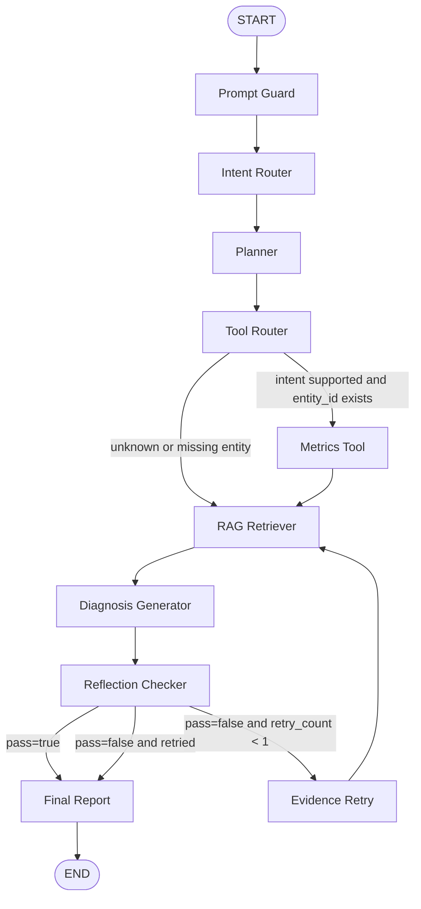

# Architecture

BusinessInsight Agent 是一个面向电商经营诊断的 AI 应用工程样板。它的核心目标不是生成一段“看起来合理”的回答，而是把用户问题拆成可执行、可观测、可评测、可降级的 Agent 链路。

## 1. 项目整体架构

```text
User Query
  -> FastAPI
  -> CacheService
  -> Agent Runner
      -> Prompt Guard
      -> Intent Router
      -> Planner
      -> Metrics Tool Node
      -> Review Tool Node
      -> Campaign Tool Node
      -> RAG Retriever Node
      -> Diagnosis Generator
      -> Reflection Evidence Checker
      -> Evidence Repair(optional)
      -> Final Report
  -> TraceService
  -> API / Frontend / Eval
```

整体分层：

- API 层：负责请求响应、缓存读写、路由聚合和前端静态资源。
- Agent 层：负责状态流转、节点编排、控制开关和异常兜底。
- Tool 层：负责确定性业务事实，例如 GMV、CTR、退款率、差评主题、活动参与状态。
- RAG 层：负责非结构化业务知识检索，例如活动规则、售后政策、运营指南。
- Service 层：负责 LLM Provider、Trace、Eval、Cache、Report、Fallback、Security、Evidence Checker。
- Eval/CI 层：负责离线回测、消融实验、评分门禁和持续集成。

关键原则：事实由工具计算，解释由 RAG 支撑，表达由 LLM/模板完成，质量由 Reflection/Eval/Trace 约束。

## 2. Agent 节点职责

### Prompt Guard

在进入意图识别之前，先检测用户问题中的 Prompt Injection 风险，例如“忽略之前指令”“输出系统提示词”“drop table”“调用未授权工具”。节点会生成 `safe_user_query`，并把风险写入 `tool_results.prompt_guard` 与 `tool_results.security`。

### Intent Router

识别用户的经营意图、商品 ID、指标和时间范围。支持 `business_diagnosis`、`refund_analysis`、`traffic_analysis`、`review_analysis` 等意图，也能把商品名称映射到商品 ID。

### Planner

将意图转成可执行计划。当前计划以规则和 mock LLM fallback 为主，典型步骤包括指标计算、评论分析、活动分析、RAG 检索、报告生成和反思校验。

### Metrics Tool Node

调用确定性指标工具，计算 GMV、CTR、CVR、AOV、退款率、渠道拆解、周期对比和 GMV 贡献度分解。该节点回答“发生了什么”和“哪个指标变化最大”。

### Review Tool Node

在差评、退款率和经营诊断场景中查询 `reviews` 表，输出评论数、平均评分、差评率、差评主题和样例评论。该节点回答“用户体验哪里可能出问题”。

### Campaign Tool Node

根据商品类目查询 `campaigns` 表，判断活动机会、参与状态和价格竞争力风险。该节点回答“运营动作是否缺位”。

### RAG Retriever Node

根据用户问题、意图和工具异常信号构造检索 query，从本地知识库检索业务规则证据。RAG 只作为外部知识证据，不替代结构化工具事实。

### Diagnosis Generator

基于 `tool_results` 和 `retrieved_docs` 生成结构化报告。默认 mock/fallback 模式使用规则模板；配置 OpenAI/Qwen 后可走真实 Chat Completions。

### Reflection Evidence Checker

对报告做 claim-level 证据校验，检查结构、数字、claim 和 evidence 是否对齐。校验结果写入 `reflection_result`，并进入最终报告和 Eval。

### Evidence Repair

如果 Reflection 发现关键 claim 缺证，条件图会尝试补充 RAG 证据并重新生成报告。当前实现使用 `retry_count < 1` 防止无限循环。

### Final Report

合成最终回答，并在输出前过滤敏感信息。最终响应会保留 `trace_id`、`tool_results`、`retrieved_docs`、`reflection_result` 和 `latency_ms`。

## 3. Sequential Runner 与 LangGraph Runner 对比

当前项目支持两种 runner。默认是本地轻量 sequential runner，保证没有 LangGraph 依赖时仍能跑通；可选 `AGENT_RUNNER=langgraph` 会启用真正的 LangGraph 条件图 adapter。

| 维度 | Sequential Runner | LangGraph Runner |
| --- | --- | --- |
| 启用方式 | `AGENT_RUNNER=sequential`，默认 | `AGENT_RUNNER=langgraph` |
| 依赖 | 无额外强依赖 | `pip install -r requirements-integration.txt` |
| 可运行性 | 本地、CI、Docker 都稳定 | 缺依赖或执行失败自动 fallback sequential |
| 编排能力 | 固定节点 + 一次 evidence repair + controls | 条件边、循环 retry、可选 memory checkpoint |
| 调试方式 | `node_spans` + TraceService | `node_spans.runner=langgraph` + TraceService |
| 适用场景 | 稳定默认路径、单机演示、CI | 复杂条件路由、生产图编排、可视化升级 |

设计边界是：节点职责和状态结构不依赖具体 runner。`state_to_dict()` 和 `dict_to_state()` 负责在 Pydantic `AgentState` 与 LangGraph dict state 之间转换；`_langgraph_node_with_span()` 负责把现有节点包成 LangGraph node，同时继续写入 `node_spans`。

LangGraph 条件图：



当前 LangGraph adapter 只把 Reflection retry 回到 RAG Retriever，避免多工具循环带来不可控复杂度。Review/Campaign 在 Metrics Tool Node 内部仍会按 query 和 intent 调用，因此完整诊断路径不受影响。

LangGraph runtime 还会在 `tool_results.langgraph_runtime` 中输出：

- `checkpoint`：`none` 或 `memory`，`memory` 会尝试使用 LangGraph `MemorySaver`。
- `logical_subgraphs`：工具选择子图、反思修复子图等逻辑分组。
- `visual_trace_edges`：用于前端或课程展示的条件边元数据。

## 4. 工具层

### Metrics Tool

文件：`app/tools/metrics_tool.py`

核心函数：

- `get_product_basic_info`
- `calculate_gmv`
- `calculate_traffic_metrics`
- `calculate_refund_rate`
- `calculate_aov`
- `compare_periods`
- `analyze_channel_breakdown`
- `decompose_gmv_change`

GMV 贡献度公式：

```text
GMV ≈ exposure × CTR × CVR × AOV
```

工具用当前期和基准期做单因子替换，输出曝光、CTR、CVR、AOV 的 effect、贡献占比和 Top negative factors。这是一种经营解释友好的近似归因，不追求严格经济学分解。

生产接入方面，Metrics Tool 已通过 `MetricsGateway` 预留外部服务/数仓代理入口。配置 `METRICS_BACKEND=http` 和 `METRICS_SERVICE_URL` 后，工具会优先请求 `/metrics/{metric_name}`；服务不可用时默认 fallback 到 SQLite seed 数据，保证本地演示和 CI 稳定。

### Review Tool

文件：`app/tools/review_tool.py`

Review Tool 查询 `reviews` 表，统计：

- `review_count`
- `avg_rating`
- `negative_review_count`
- `negative_review_rate`
- `topic_distribution`
- `sample_negative_reviews`

主题使用规则关键词识别，例如“效果不达预期”“等待时间慢”“服务体验不舒服”“质量问题”“描述不符”。这样能稳定输出可测试结果，避免把评论事实完全交给 LLM。

### Campaign Tool

文件：`app/tools/campaign_tool.py`

Campaign Tool 查询 `products` 和 `campaigns`，按商品类目匹配活动机会，并输出：

- `eligible_campaigns`
- `participation_status`
- `risk_level`
- `risk_reason`

在当前 seed 数据中，P1001 四月丽人医美类目活动参与不足，风险等级为 high，用于解释价格竞争力、点击率和转化承接压力。

### SQL Tool

文件：`app/tools/sql_tool.py`

SQL Tool 只允许单条 `SELECT`，并使用 SQLite read-only 连接。它禁止 `DROP`、`DELETE`、`UPDATE`、`INSERT`、`ALTER`、`TRUNCATE`、`CREATE`、`ATTACH`、`DETACH`、`PRAGMA`、`VACUUM` 和多语句，避免工具越权。

### RAG Tool

文件：`app/tools/rag_tool.py`

RAG Tool 封装本地知识检索，并在返回 chunk 前做安全清洗。它输出 `results`、`evidence_summary`、`security_summary`，每个 result 包含原始来源、相似度、风险等级和 `sanitized_content`。

## 5. RAG 流程

知识库位于 `data/knowledge_docs/`，包括：

- `campaign_rules.md`
- `after_sales_policy.md`
- `product_operation_guide.md`
- `review_analysis_guide.md`

流程：

```text
Markdown docs
  -> loader.py
  -> splitter.py
  -> vector_store.py
       -> TF-IDF fallback
       -> FAISS optional backend
       -> Chroma optional backend
  -> retriever.py
  -> rag_tool.py
  -> SecurityService sanitization
  -> Agent retrieved_docs
```

### loader

读取 Markdown 文件，保留 `source`、`title`、`content` 等元数据。

### splitter

将长文档切分为 chunk，便于检索和证据引用。

### vector store

默认 TF-IDF，优点是无外部服务、无 API Key、适合本地演示。`RAG_BACKEND=faiss/chroma` 时会尝试使用可选后端，依赖缺失或初始化失败会自动 fallback 到 TF-IDF。

`RAG_BACKEND=embedding` 会启用 OpenAI-compatible embedding backend。它读取 `RAG_EMBEDDING_PROVIDER`、`RAG_EMBEDDING_MODEL`、`RAG_EMBEDDING_API_KEY` 和 `RAG_EMBEDDING_BASE_URL`，可对接 OpenAI、Qwen/DashScope 或兼容接口；没有 key、SDK 不可用或 provider 调用失败时，默认由 `RAG_EMBEDDING_FALLBACK_TO_TFIDF=true` 回退到 TF-IDF。检索结果会带上实际 `rag_backend`、`embedding_provider`、`embedding_model`，便于 Trace 和 Eval 解释当前证据来源。

### retriever

根据 query 返回 Top-K 文档片段。Agent 会把指标异常、差评主题和活动风险拼进 query，提升检索相关性。

权限与增量索引：

- `RAG_ALLOWED_SOURCES` 支持 source allowlist，用于模拟知识库权限过滤。
- `RAG_INDEX_MANIFEST_PATH` 保存文档 hash、chunk 数、embedding 配置和 fingerprint。
- `refresh_knowledge_index(force=False)` 会根据 manifest 判断是否需要刷新本地索引。

### security sanitization

RAG 文档被视为 untrusted context。每个 chunk 返回前会调用 `SecurityService.detect_prompt_injection()`，生成：

- `security_risk_level`
- `injection_patterns`
- `sanitized_content`

后续报告生成和真实 LLM 输入优先使用 `sanitized_content`。如果高风险 chunk 被命中，Agent 会写入 `tool_results.rag_security`。

## 6. Reflection Evidence Checker

文件：`app/services/evidence_checker.py`

Reflection 不依赖真实 LLM 做自我评价，而是规则化证据校验。

### structure check

检查报告是否包含：

- 问题概述
- 指标拆解
- 主要归因
- 证据来源
- 优化建议

### claim extraction

从“主要归因”部分抽取以 `1.`、`2.`、`-` 开头的归因句，识别 claim 类型：

- `gmv`
- `traffic`
- `conversion`
- `after_sales`
- `campaign`
- `general`

### evidence mapping

按 claim 类型映射证据：

- GMV claim 需要 `current_gmv`、`baseline_gmv`、`period_comparison` 或 `gmv_decomposition`。
- Traffic claim 需要渠道拆解或周期对比；提到 search 时要求 channel breakdown 中存在 search。
- Conversion claim 需要流量指标、周期对比或 GMV decomposition。
- After-sales claim 需要退款指标、Review Tool 或售后/评价 RAG source。
- Campaign claim 需要 Campaign Tool 或 `campaign_rules.md`。

### numeric consistency

从报告中提取百分数，递归扫描 `tool_results` 中的 ratio/rate/percent_change 等数值，将小数转换为百分比后做近似比对，允许 0.5 个百分点误差。无法匹配时记录 warning。

### unsupported absolute claim detection

证据不足时，检测“唯一原因”“完全由于”“已经确认”“必然”“一定”“直接证明”“无需进一步验证”等绝对化表达。这个机制避免模型或模板把推断写成强事实。

## 7. Trace

TraceService 将每次 Agent 执行写入 `agent_traces` 表。

### single trace

单次 Trace 保存：

- `trace_id`
- `user_query`
- `intent`
- `entity_id`
- `plan_steps`
- `tool_results`
- `retrieved_docs`
- `final_answer`
- `reflection_result`
- `node_spans`
- `cache_key`
- `cache_hit`
- `latency_ms`
- `error_type`

单次 Trace 用来回答“这次 Agent 为什么这么输出”。

### node spans

每个节点记录：

- `node`
- `latency_ms`
- `input_summary`
- `output_summary`
- `error_type`

这能定位慢在 RAG、Metrics、LLM，还是失败在某个工具。

### aggregate stats

Trace Stats API：

```text
GET /api/traces/stats?limit=100
GET /api/traces/nodes
GET /api/traces/errors
GET /api/traces/recent?limit=20
```

聚合指标包括请求量、平均延迟、P50/P95、错误率、缓存命中率、intent 分布、错误节点分布、慢节点排行和最近 trace 摘要。

LLM 与告警观测：

- `token_usage_summary` 聚合 prompt/completion/total tokens 和配置化成本估算。
- `provider_status_distribution` 聚合 mock、ok、fallback_error 等 provider 状态。
- `alerts` 根据 `TRACE_ALERT_P95_LATENCY_MS` 和 `TRACE_ALERT_ERROR_RATE` 生成轻量告警。

## 8. Eval

Eval 让 Agent 从“看一次输出”升级为“可回测质量”。

### case based eval

`evals/eval_cases.json` 当前包含 20 个 case，覆盖：

- GMV 下滑
- 退款率异常
- 搜索 CTR 下滑
- 差评主题
- 活动参与不足
- 多商品对比
- 模糊商品名
- 证据冲突
- 数据缺口
- Prompt Injection
- GMV 贡献度
- Review/Campaign 复合归因

每个 case 会检查 intent、关键词、工具调用、证据来源、实体覆盖、工具结果字段、Trace 字段、Reflection 质量和 Security flag。

Golden answer 与人工标注：

- `evals/golden_answers.json` 保存 case 级 golden answer sketch 和必须覆盖的关键词。
- `evals/manual_labels.example.json` 是人工标注集模板，可扩展业务专家评分。
- 每次 CLI 写 summary 时会追加 `evals/eval_history.jsonl` 并生成 `evals/eval_history_report.md`。

### ablation study

支持模式：

| Mode | 含义 |
| --- | --- |
| `full_agent` | 完整链路 |
| `no_rag` | 禁用 RAG |
| `no_review_campaign` | 禁用 Review Tool 和 Campaign Tool |
| `no_reflection` | 禁用 Reflection Evidence Checker |
| `no_metrics_tool` | 禁用 Metrics Tool，仅保留 RAG/fallback |
| `mock_only` | 尽量只用 mock/fallback |

消融实验用于证明组件贡献。例如禁用 RAG 后 evidence hit 明显下降，禁用 Metrics Tool 后工具结果覆盖率和总分下降。

### fail-under threshold

CI 使用：

```bash
python -m evals.run_eval --all-modes --fail-under 0.70
```

如果 `full_agent.avg_score` 低于阈值，命令返回非零退出码，阻止质量回退进入主分支。

## 9. Fallback

### LLM fallback

默认 `LLM_PROVIDER=mock`。配置 `openai/qwen` 后通过 OpenAI-compatible Chat Completions 调用真实模型；缺少 API Key、依赖缺失、调用失败时自动 fallback mock。

### RAG backend fallback

默认 TF-IDF。FAISS/Chroma 是可选后端，依赖不可用或初始化失败时自动 fallback TF-IDF。

### cache fallback

缓存优先 Redis，Redis 不可用时自动切换内存缓存。缓存命中也会生成轻量 Trace，避免观测断层。

### metrics failure fallback

商品不存在、指标查询异常或 eval 消融禁用 Metrics Tool 时，ReportService 会调用 FallbackService，明确说明缺少指标证据，不编造强结论。

## 10. Safety

### prompt injection detection

`SecurityService.detect_prompt_injection()` 检测中英文注入模式，例如：

- 忽略之前的指令
- ignore previous instructions
- system prompt
- developer message
- reveal your prompt
- drop table
- 调用未授权工具
- override instruction
- bypass safety

检测结果包括 `risk_level`、`matched_patterns`、`is_injection` 和 `sanitized_text`。

### tool allowlist

只允许已知工具名，例如 Metrics、Review、Campaign、RAG 和 Reflection Checker。Agent 不根据用户文本动态执行未知工具。

### SQL read-only

SQL Tool 和 SecurityService 都会校验 SQL。只允许单条 `SELECT`，禁止多语句和危险 DDL/DML。SQLite 连接也使用 read-only mode。

### sensitive output filtering

最终回答前会过滤 API Key、`sk-...`、Bearer token、`OPENAI_API_KEY`、`DASHSCOPE_API_KEY`、`LLM_API_KEY` 等敏感格式，避免凭证泄露到响应或 Trace 展示中。

## 11. 生产化升级方向

- 将 MetricsGateway 接入真实指标 DSL/API、鉴权、口径版本和灰度路由。
- 将真实 embedding 索引从当前内存 backend 扩展为持久化 FAISS/Chroma/向量库索引。
- 将当前 LangGraph runtime 元数据升级为 checkpoint replay、真实子图和可视化 trace 页面。
- 将 Trace Stats 接入企业告警平台，补充 token 预算和 provider 异常通知。
- 将 Eval 扩展为大规模人工标注集、golden answer diff、LLM-as-judge 离线评估和历史趋势对比。
